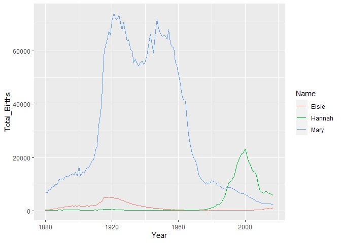
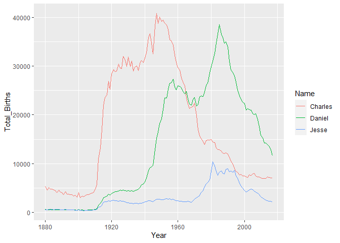

Hannah’s Family’s Name Popularity
================

# Family Names

## Matriarch

``` r
babyname_hannah <- babynames %>% 
  filter((name == "Hannah" | name == "Mary" | name == "Elsie") & sex == "F") %>% 
  mutate(Total_Births = n, Year = year, Name = name)


ggplot(babyname_hannah, aes(x = Year, y = Total_Births, color = Name)) +
  geom_line()
```

<!-- -->

## Patriarch

``` r
babyname_jesse <- babynames %>% 
  filter((name == "Jesse" | name == "Daniel" | name == "Charles") & sex == "M") %>% 
  mutate(Total_Births = n, Year = year, Name = name)


ggplot(babyname_jesse, aes(x = Year, y = Total_Births, color = Name)) +
  geom_line()
```

<!-- -->
